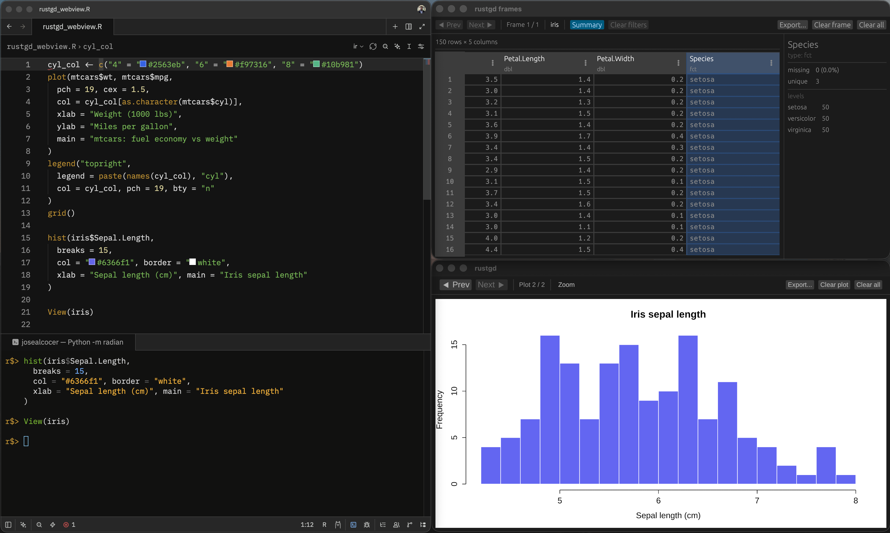
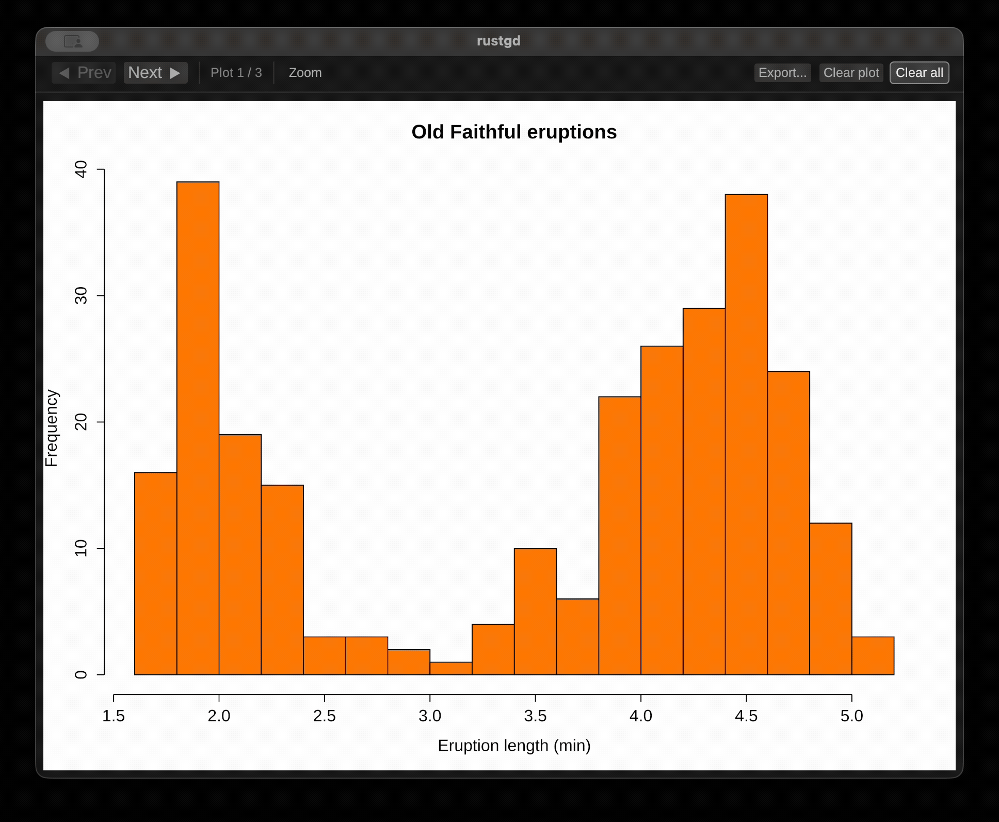
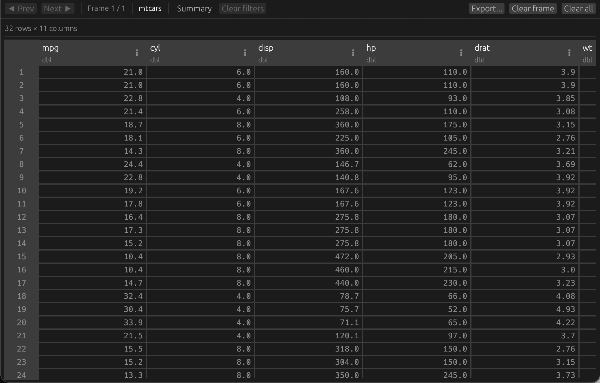
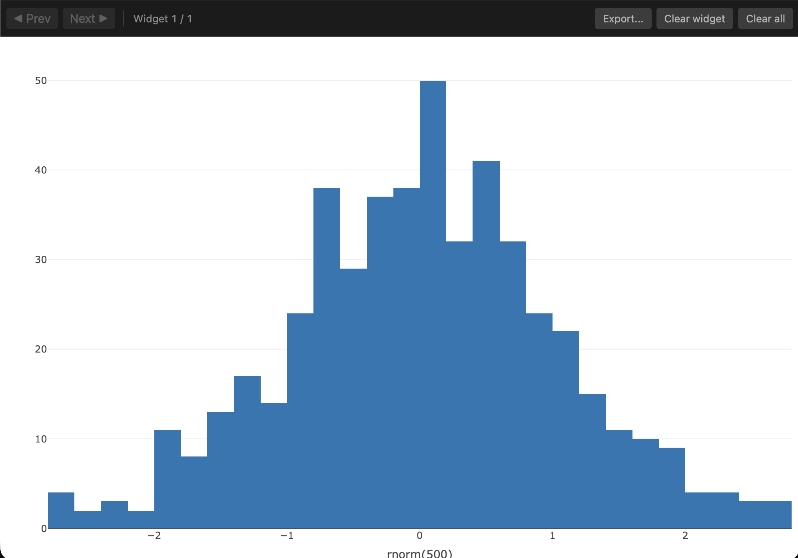

# rustgd

<!-- badges: start -->
[](https://alcocer-jj.r-universe.dev/rustgd)
<!-- badges: end -->

Native plot, data frame, and HTML viewer windows for R sessions that live in a terminal or a lean editor.



## What it is

rustgd gives a plain R session the three things a full IDE would normally hand you: a graphics window for plots, a spreadsheet-style window for data frames, and a web window for HTML widgets and Shiny apps. The viewers are native desktop windows written in Rust, launched directly from R, and bundled inside the package, so once it is installed there is nothing else to set up.

It is built for the way many people actually run R day to day: `radian` in a terminal, and/or an editor such as Zed or Neovim driving an R process that has no built-in panes. In those setups a `plot()` has nowhere to go, `View()` is missing or clumsy, and printing a leaflet map or a plotly chart throws you out to a browser tab. rustgd closes that gap.

## Why it was made

RStudio and Positron ship with a Plots pane, a data viewer, and an HTML Viewer pane. Terminal and editor workflows do not. If you would rather work in `radian` and a modern editor than in a full IDE, you give those panes up, and the usual fallbacks (e.g., saving plots to disk, opening data in a pager, bouncing widgets through the browser) are a poor substitute for a window that simply appears when you draw something.

rustgd exists to get those windows back without adopting an IDE. The rendering and table handling are done in Rust rather than in R, which keeps the windows fast and the runtime footprint small.

## The three viewers

### Plots



rustgd registers a real R graphics device. Every `plot()`, `hist()`, base-graphics build-up, or printed `ggplot` renders into a dedicated window. The window keeps a gallery of every plot you draw in the session, so you can page back and forth with the toolbar or the arrow keys, zoom and pan into a plot, and export the current one to PNG or SVG. It follows your system light or dark setting, and it re-renders on resize so a plot stays sharp at any window size rather than being stretched.

### Data frames



`View(df)` opens a fast, scrollable table. Columns sort, resize, and filter, with a level checklist for factors, a contains box for text, and a min and max range for numeric columns; the row count updates as filters narrow the data. A Summary panel reports per-column statistics such as missing count, unique count, and a type-appropriate breakdown over what is currently shown. Every frame you view stays loaded, so paging back to an earlier one restores its sort, selection, and scroll position. The current view, filtered and in its current order, exports to Arrow or CSV.

### HTML and web content


The web viewer takes over R's HTML viewer and Shiny launcher, so htmlwidgets (plotly, leaflet, dygraphs, and the like) and Shiny apps open in a native window instead of a browser tab. Each widget is copied into a per-session folder so the window does not depend on R's temporary files, and widgets accumulate into a gallery you can page through, export, or clear.



For anything that already lives at a live address, a Shiny app, a local dashboard, or a dev server, `rustgd_browse(url)` points the same window straight at it.

## How it works

Under the hood rustgd is an R package with a Rust core built using extendr. The plot device is a true R graphics device compiled into the package; it serializes each page to SVG and hands it to a separate viewer process through a per-session temporary directory. That same directory is how the window signals resizes back to R, which is what lets the device replay a plot at the new size instead of scaling a bitmap.

The data frame and web viewers are two more small native binaries. `View()` is rewired to write your data as Apache Arrow and feed the table window, and R's `viewer` and `shiny.launch.browser` options are pointed at the web binary so widgets and apps route there automatically. All three binaries are compiled when the package builds and shipped inside it, so there is nothing extra to download or launch at runtime. The windows open lazily, the first time you actually draw a plot, view a frame, or show a widget.

## Installation

### From R-universe (recommended)

A prebuilt binary, no compiler required:

```r
install.packages("rustgd",
  repos = c("https://alcocer-jj.r-universe.dev",
            "https://cloud.r-project.org"))
```

### From GitHub (source)

This compiles on your machine, so it needs a Rust toolchain (`cargo` and `rustc`, easiest via [rustup](https://rustup.rs)):

```r
# install.packages("remotes")
remotes::install_github("alcocer-jj/rustgd")
```

rustgd requires R 4.2 or newer. Prebuilt binaries are served for macOS and Windows on the current R release and the previous one. On Linux, install from source; the windows use the system's standard desktop graphics and WebKit libraries.

rustgd does not run under WebAssembly or webR. The viewers are native desktop windows, so a browser-based R session has nothing to open.

## Turning it on and off

Turn all three viewers on, both for the current session and for every session afterward:

```r
library(rustgd)
use_rustgd()
```

Turn everything back off and restore R's defaults:

```r
unuse_rustgd()
```

`use_rustgd()` activates the viewers now and writes a small snippet to your `~/.Rprofile` so new sessions start with rustgd already on. `unuse_rustgd()` removes that snippet and restores the normal graphics device, `View()`, and HTML viewer. The snippet only runs in interactive sessions, so `Rscript`, R CMD BATCH, knitr, and package checks are left alone.

`use_rustgd()` takes a `mode` argument that affects only the plot window. The default, `"lazy"`, registers the device so the window opens the first time you draw a plot, the same way base R's `quartz` and `X11` behave. Pass `"eager"` to open a plot window straight away, before you plot anything:

```r
use_rustgd(mode = "eager")
```

The web viewer and the `View()` route turn on immediately in either mode.

To switch the viewers on or off for the current session only, without touching `.Rprofile`:

```r
rustgd_enable()
rustgd_disable()
```

And to open a live URL in the web window:

```r
rustgd_browse("http://127.0.0.1:4321")
```

## License

MIT. See [LICENSE](LICENSE).
